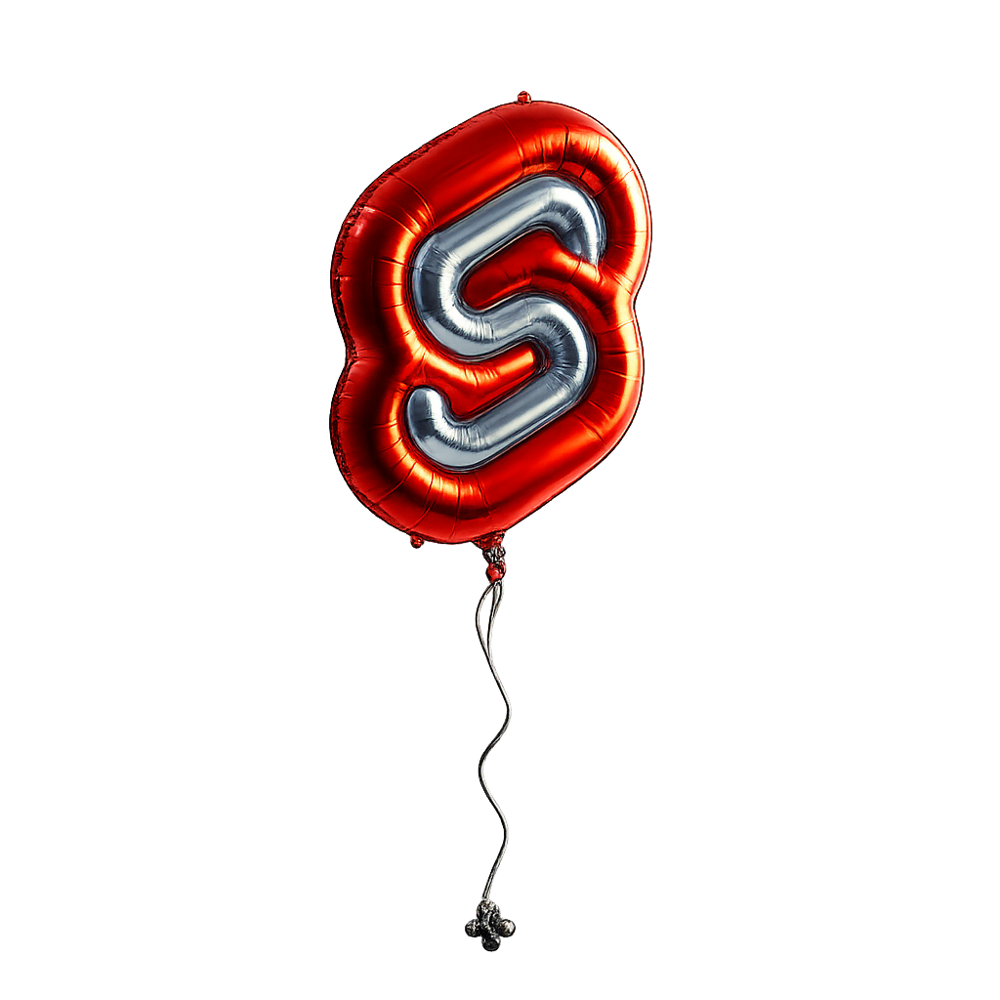

<p align="center">
  
</p>

<h1 align="center">svelte-floating-attach</h1>

Svelte 5 <a href="https://svelte.dev/docs/svelte/@attach">attachment</a>-based wrapper for <a href="https://floating-ui.com/docs/getting-started"><code>@floating-ui/dom</code></a>. Position floating elements like tooltips, popovers, and dropdowns with automatic reactivity — no <code>$effect</code> or manual <code>update()</code> calls needed.

For middleware options, placement values, and positioning concepts, see the [Floating UI docs](https://floating-ui.com/docs/getting-started).

## Requirements

- Svelte `>=5.29.0` (attachment support)
- `@floating-ui/dom` `>=1.6.0`

## Install

```bash
npm install svelte-floating-attach @floating-ui/dom
```

## Usage

### Basic Popover

```svelte
<script>
  import { createFloating, offset, flip, shift } from 'svelte-floating-attach'

  let show = $state(false)
  const { ref, content } = createFloating()
</script>

<button {@attach ref} onclick={() => show = !show}>
  Toggle
</button>

{#if show}
  <div {@attach content({
    placement: 'bottom',
    middleware: [offset(8), flip(), shift()],
  })}>
    Popover content
  </div>
{/if}
```

### Reactive Placement (Component Props)

A complete example showing how placement reacts to prop changes and how `onComputed` keeps the actual placement in sync when Floating UI flips it due to lack of space.

```svelte
<!-- Popover.svelte -->
<script lang="ts">
  import type { Snippet } from 'svelte'
  import type { Placement } from 'svelte-floating-attach'
  import { createFloating, offset, flip, shift, hide } from 'svelte-floating-attach'

  interface Props {
    /** Preferred placement — may be overridden by flip() */
    placement?: Placement
    show?: boolean
    children?: Snippet
    content?: Snippet
  }

  let {
    placement = $bindable('bottom'),
    show = $bindable(false),
    children,
    content: contentSnippet,
  }: Props = $props()

  const { ref, content: floatingContent } = createFloating()
</script>

<button {@attach ref} onclick={() => show = !show}>
  {@render children?.()}
</button>

{#if show}
  <div {@attach floatingContent({
    placement,
    middleware: [offset(8), shift(), flip(), hide()],
    onComputed: (data) => (placement = data.placement),
  })}>
    {@render contentSnippet?.()}
  </div>
{/if}
```

When the consumer passes a different `placement` prop, the attachment re-runs automatically — no `$effect` needed. The `onComputed` callback writes back the actual placement so the consumer always knows where the popover ended up (e.g., `'top'` instead of `'bottom'` after a flip).

```svelte
<!-- Consumer.svelte -->
<script>
  import Popover from './Popover.svelte'

  let placement = $state('bottom')
</script>

<select bind:value={placement}>
  <option value="top">Top</option>
  <option value="bottom">Bottom</option>
  <option value="left">Left</option>
  <option value="right">Right</option>
</select>

<Popover bind:placement>
  {#snippet content()}
    Placed at: {placement}
  {/snippet}
  Click me
</Popover>
```

### Tooltip with Arrow

```svelte
<script>
  import { createFloating, offset, flip, shift } from 'svelte-floating-attach'

  let show = $state(false)
  const { ref, content, arrow, arrowMiddleware } = createFloating()
</script>

<button
  {@attach ref}
  onmouseenter={() => show = true}
  onmouseleave={() => show = false}
>
  Hover me
</button>

{#if show}
  <div {@attach content({
    placement: 'top',
    middleware: [offset(8), flip(), shift(), arrowMiddleware({ padding: 4 })],
  })}>
    Tooltip text
    <div {@attach arrow} class="arrow"></div>
  </div>
{/if}
```

### Virtual Element

```svelte
<script>
  import { createFloating, createVirtualElement, offset } from 'svelte-floating-attach'

  const virtual = createVirtualElement({
    getBoundingClientRect: { x: 0, y: 0, top: 0, left: 0, bottom: 0, right: 0, width: 0, height: 0 }
  })

  const { setVirtualReference, content } = createFloating()
  setVirtualReference(virtual)

  let show = $state(false)
</script>

<div
  onmouseenter={() => show = true}
  onmouseleave={() => show = false}
  onmousemove={(e) => {
    virtual.update({
      getBoundingClientRect: {
        x: e.clientX, y: e.clientY,
        top: e.clientY, left: e.clientX,
        bottom: e.clientY, right: e.clientX,
        width: 0, height: 0,
      }
    })
  }}
>
  Hover area
</div>

{#if show}
  <div {@attach content({ strategy: 'fixed', placement: 'right-start', middleware: [offset(16)] })}>
    Following cursor
  </div>
{/if}
```

## Why Svelte 5 Only?

Svelte 5 introduced [attachments](https://svelte.dev/docs/svelte/@attach) (`{@attach}`), which run in the template's reactive tracking context. This means they automatically re-run when any reactive value in their arguments changes — something **actions** (`use:`) cannot do.

With actions, you need a manual `$effect` to push updated options whenever a prop like `placement` changes:

```svelte
<script>
  import { createFloatingActions } from 'svelte-floating-ui'
  import { flip, offset, shift } from 'svelte-floating-ui/dom'

  let { placement = $bindable('bottom') } = $props()

  const [floatingRef, floatingContent, updatePosition] = createFloatingActions({
    placement,
    middleware: [offset(8), shift(), flip()],
  })

  // Required: manually sync reactive props to the action
  $effect(() => {
    updatePosition({ placement })
  })
</script>

<button use:floatingRef>Trigger</button>
<div use:floatingContent>Content</div>
```

With attachments, the same thing is automatic:

```svelte
<script>
  import { createFloating, flip, offset, shift } from 'svelte-floating-attach'

  let { placement = $bindable('bottom') } = $props()

  const { ref, content } = createFloating()
</script>

<button {@attach ref}>Trigger</button>
<div {@attach content({
  placement,
  middleware: [offset(8), shift(), flip()],
})}>
  Content
</div>
```

This library is built entirely on attachments, which is why it requires Svelte `>=5.29.0`. If you're on Svelte 4 or an older version of Svelte 5, check out [`svelte-floating-ui`](https://github.com/fedorovvvv/svelte-floating-ui) — the action-based library that inspired this one.

## API

### `createFloating()`

Creates a floating instance. Returns:

| Property              | Type                           | Description                                               |
| --------------------- | ------------------------------ | --------------------------------------------------------- |
| `ref`                 | `Attachment`                   | Attach to the reference/trigger element                   |
| `content`             | `(options?) => Attachment`     | Returns an attachment for the floating element            |
| `arrow`               | `Attachment`                   | Attach to the arrow/caret element                         |
| `arrowMiddleware`     | `(options?) => Middleware`     | Creates arrow middleware using the captured arrow element |
| `setVirtualReference` | `(el: VirtualElement) => void` | Set a virtual element as the reference                    |

### `FloatingContentOptions`

Options passed to `content()`. See [Floating UI docs](https://floating-ui.com/docs/computePosition) for details on `placement`, `strategy`, and `middleware`.

| Option       | Type                                                                  | Default      | Description                                                             |
| ------------ | --------------------------------------------------------------------- | ------------ | ----------------------------------------------------------------------- |
| `placement`  | [`Placement`](https://floating-ui.com/docs/computePosition#placement) | `'bottom'`   | Where to place the floating element                                     |
| `strategy`   | [`Strategy`](https://floating-ui.com/docs/computePosition#strategy)   | `'absolute'` | CSS positioning strategy                                                |
| `middleware` | [`Middleware[]`](https://floating-ui.com/docs/middleware)             | `undefined`  | Floating UI middleware array                                            |
| `autoUpdate` | `boolean \| AutoUpdateOptions`                                        | `true`       | [Auto-update](https://floating-ui.com/docs/autoUpdate) on scroll/resize |
| `onComputed` | `(data: ComputePositionReturn) => void`                               | `undefined`  | Callback after position computation                                     |

### `createVirtualElement(config)`

Creates a mutable [virtual element](https://floating-ui.com/docs/virtual-elements) for non-DOM references (e.g., cursor position). Call `.update(config)` to change the position.

### Re-exports

All middleware and types from `@floating-ui/dom` are re-exported for convenience, so you only need one import source.

## How It Works

Svelte 5 [attachments](https://svelte.dev/docs/svelte/@attach) run in the template's tracking context. When you write:

```svelte
<div {@attach content({ placement, middleware: [...] })}>
```

The `content(...)` thunk is evaluated inside an effect. When `placement` (a `$state` or `$bindable` value) changes, the attachment:

1. Runs its cleanup function (tears down `autoUpdate` listeners)
2. Re-runs with the new options (sets up fresh `autoUpdate` + computes position)

This is the same teardown/re-init pattern that Svelte uses for all attachments. For floating-ui, the cost is negligible since `autoUpdate` setup is just a few event listeners and observers.

## License

MIT
